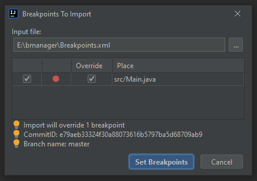

# Breakpoint Manager

Breakpoint Manager provides support to import/export breakpoints and manage your breakpoints using tags.

Supported breakpoints:
<ul>
    <li>Java: line, field, method breakpoints</li>
    <li>Scala: line breakpoints</li>
    <li>Python: line breakpoint</li>
</ul>

Breakpoints are exported to a xml file. You can do it by right-clicking in the supported language editor source file (e.g. java file)
and select Open Breakpoint Manager action or Export Breakpoints action.

Plugin doesn't require any configuration.

## Import/Export rules

The key requirement to import/export breakpoints is the relative path of file in which breakpoint was set. 
So for example if breakpoint was set in `/home/foo/%PROJECT_NAME%/bar/Main.java` the key value during the import process 
will be the relative path `/bar/Main.java` (project name can be different).

Also, the code in target file should be the same as in source file, but this is described in `Import Breakpoints dialog` section with more details.

## Breakpoint Manager plugin dialog

To enter Breakpoint Manager dialog right-click in the supported language source file editor and click `Open Breakpoint Manager` action.

And you will see the following dialog:

To export breakpoints from Breakpoint Manager dialog you need to check checkbox of desired breakpoint 
from the left breakpoints tree. You can also select the output file name and path. The default file name is `Breakpoints`. 
After clicking `Export` button, checked breakpoints will be saved to a xml file.

On the dialogs main panel there are other actions such as:

- Mute Breakpoints - mute checked breakpoints from the tree
- Unmute Breakpoints - unmute checked breakpoints from the tree
- Remove Breakpoints - remove checked breakpoints from the tree
- Remove tags - remove checked tags from the table

From the tree panel you can manage tags of breakpoint (just right click on desired breakpoint):

This action will open another dialog in which you can add/edit/remove tags.

## Tags

By using tags you can select or deselect breakpoints on the left tree panel. 
This can be helpful to organize a big number of breakpoints.

Tags are also visible in the source file editor:

## Other Actions

By right-clicking in the editor source file you will see following actions:

- Export Breakpoints - this action will open dedicated dialog to export breakpoints
- Import Breakpoints - opens dialog to import breakpoints from xml file
- Disable Tags - stop showing breakpoint tags in the editor (visible if tags are enabled)
- Open Breakpoint Manager - opens Breakpoint Manager dialog
- Refresh Tags - refreshes tags
- Enable Tags - start showing breakpoint tags in the editor (visible if tags are disabled)

## Export Breakpoints dialog

Export Breakpoints dialog is a second way to export breakpoints but is more dedicated for this task. 
It is similar to the existing Intellij Breakpoints dialog. You can from this point review existing breakpoints.

To export breakpoints just check desired breakpoint checkbox, provide output file name and path, and hit `Export` button.

## Import Breakpoints dialog

To import breakpoints click `Import Breakpoints` action from the actions list.

And you will see the following dialog:

In `Input file` provide path to exported xml (click `...` button). After that, table will be filled
with breakpoints which can be imported.

If you don't want to import a particular breakpoint uncheck the checkbox in the 1st column. 
If you want to force breakpoint override check the checkbox in the 3rd column. 
This situation may happen when we want to set a breakpoint to a line where there is already a breakpoint.

If your project is a git repository and current commit hash is different from imported breakpoints we will receive an appropriate warning.

## Plans

Kotlin support will be added after releasing Kotlin plugin for Intellij 2021.2.

Further, releases will provide support for other programming languages.